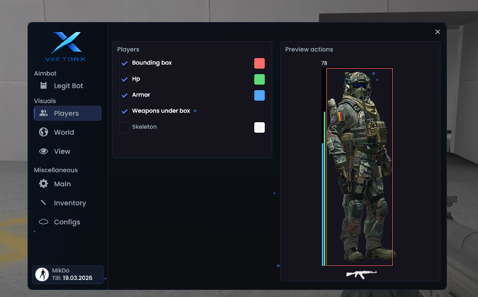

# TIMMY BLACK ImGui Menu (C++)

This folder contains a C++ Dear ImGui clone of your Python menu from `main.py` + `app/ui.py`
Included:
- `Main` and `Misc` tabs
- `ESP`, `AimBot`, `Glow`, `Visual` panels
- Working UI controls (toggle buttons, slider, input text, color picker)
- Close button in title bar
- Live ESP draw (box + HP bar + skeleton) linked to the `ESP -> Toggle`

ESP runtime details:
- Attaches to `cs2.exe` and reads `client.dll` memory (`dwEntityList`, `dwLocalPlayerPawn`, `dwViewMatrix`)
- Uses offsets from:
  - `https://raw.githubusercontent.com/a2x/cs2-dumper/main/output/offsets.json`
  - `https://raw.githubusercontent.com/a2x/cs2-dumper/main/output/client_dll.json`
- If download fails, falls back to local `CS2-GFusion-Python-main/offsets/*.json` and embedded defaults
- Tries to read `bone_ids` from the downloaded dump; otherwise uses the standard Python `bone_ids` map
- Renders only in overlay mode (menu hidden via `Insert`)

## Build (CMake)

```bash
cd C+Fgo
cmake -S . -B build
cmake --build build --config Release
```

Run:
- Windows: `build/Release/timmy_menu.exe` (or `build/timmy_menu.exe` with single-config generators)

## Notes

- CMake fetches `glfw` and `imgui` automatically from GitHub.
- Optional font load path is `../fonts/Manrope-Variable.ttf`; fallback font is always available.
